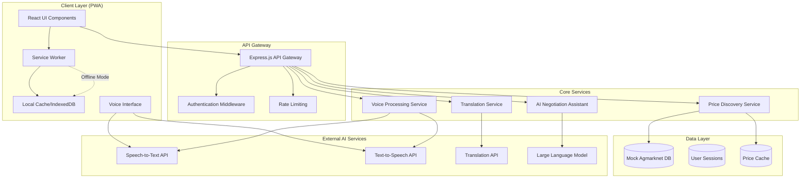

# Design Document: Multilingual Mandi - AI Trade Companion

## Overview

The Multilingual Mandi system is a Progressive Web Application (PWA) designed to empower farmers and small vendors in Indian mandis with voice-first price discovery, real-time multilingual translation, and AI-powered negotiation assistance. The system prioritizes mobile-first design, offline resilience, and accessibility for users with varying literacy levels.

The architecture follows a client-server model with intelligent caching strategies to ensure functionality in areas with poor network connectivity. The system integrates multiple AI services for speech recognition, translation, and price analysis while maintaining a simple, intuitive user interface.

## Architecture

### High-Level Architecture



### Technology Stack

**Frontend:**
- React 18 with TypeScript for type safety
- Tailwind CSS for mobile-first responsive design
- PWA capabilities with service workers
- Web Speech API for browser-native voice recognition (fallback)
- IndexedDB for offline data storage

**Backend:**
- Node.js with Express.js for API server
- TypeScript for consistent type safety
- In-memory caching with Redis-like structure
- Mock database simulating Agmarknet data

**AI Integration Points:**
- Speech-to-Text: Web Speech API (primary), AWS Transcribe or OpenAI Whisper (fallback)
- Text-to-Speech: Web Speech API (primary), AWS Polly (fallback)
- Translation: Sarvam AI or Google Translate API for Indian languages
- LLM: OpenAI GPT-4 or AWS Bedrock for negotiation assistance

## Components and Interfaces

### Frontend Components

#### VoiceInterface Component
```typescript
interface VoiceInterfaceProps {
  language: SupportedLanguage;
  onVoiceInput: (text: string, confidence: number) => void;
  onError: (error: VoiceError) => void;
  isListening: boolean;
}

interface VoiceError {
  type: 'network' | 'permission' | 'recognition' | 'timeout';
  message: string;
  retryable: boolean;
}
```

#### TranslationBridge Component
```typescript
interface TranslationBridgeProps {
  sourceLanguage: SupportedLanguage;
  targetLanguage: SupportedLanguage;
  onTranslation: (original: string, translated: string) => void;
  conversationHistory: ConversationMessage[];
}

interface ConversationMessage {
  id: string;
  speaker: 'vendor' | 'buyer';
  originalText: string;
  translatedText: string;
  timestamp: Date;
  language: SupportedLanguage;
}
```

#### PriceDiscoveryCard Component
```typescript
interface PriceDiscoveryCardProps {
  commodity: Commodity;
  priceData: PriceData;
  trend: PriceTrend;
  isOffline: boolean;
  lastUpdated: Date;
}

interface PriceData {
  minimum: number;
  maximum: number;
  modal: number;
  unit: string;
  market: string;
}
```

#### NegotiationAssistant Component
```typescript
interface NegotiationAssistantProps {
  currentOffer: number;
  commodity: Commodity;
  marketPrice: PriceData;
  onSuggestion: (suggestion: NegotiationSuggestion) => void;
}

interface NegotiationSuggestion {
  counterOffer: number;
  reasoning: string;
  confidence: number;
  language: SupportedLanguage;
}
```

### Backend Services

#### Price Discovery Service
```typescript
class PriceDiscoveryService {
  async getCurrentPrices(commodity: Commodity, market?: string): Promise<PriceData>;
  async getPriceTrends(commodity: Commodity, days: number): Promise<PriceTrend[]>;
  async updatePriceCache(): Promise<void>;
  async getOfflinePrices(commodity: Commodity): Promise<CachedPriceData>;
}

interface PriceTrend {
  date: Date;
  price: number;
  volume: number;
  change: number;
}
```

#### Translation Service
```typescript
class TranslationService {
  async translateText(
    text: string, 
    from: SupportedLanguage, 
    to: SupportedLanguage
  ): Promise<TranslationResult>;
  
  async detectLanguage(text: string): Promise<SupportedLanguage>;
  async getCachedTranslation(text: string, languagePair: string): Promise<string | null>;
}

interface TranslationResult {
  translatedText: string;
  confidence: number;
  detectedLanguage?: SupportedLanguage;
}
```

#### AI Negotiation Service
```typescript
class NegotiationService {
  async generateCounterOffer(
    offer: number,
    commodity: Commodity,
    marketData: PriceData,
    context: NegotiationContext
  ): Promise<NegotiationSuggestion>;
  
  async analyzeOffer(
    offer: number,
    marketPrice: number
  ): Promise<OfferAnalysis>;
}

interface NegotiationContext {
  quantity: number;
  quality: QualityGrade;
  seasonality: SeasonalFactor;
  urgency: UrgencyLevel;
}
```

#### Voice Processing Service
```typescript
class VoiceProcessingService {
  async speechToText(
    audioBlob: Blob, 
    language: SupportedLanguage
  ): Promise<SpeechResult>;
  
  async textToSpeech(
    text: string, 
    language: SupportedLanguage
  ): Promise<AudioBuffer>;
  
  async processVoiceCommand(
    text: string, 
    language: SupportedLanguage
  ): Promise<VoiceCommand>;
}

interface VoiceCommand {
  intent: 'price_query' | 'negotiation' | 'help' | 'unknown';
  commodity?: Commodity;
  parameters: Record<string, any>;
}
```

## Data Models

### Core Domain Models

```typescript
enum SupportedLanguage {
  HINDI = 'hi',
  ENGLISH = 'en',
  TAMIL = 'ta',
  TELUGU = 'te',
  BENGALI = 'bn',
  GUJARATI = 'gu',
  MARATHI = 'mr',
  PUNJABI = 'pa'
}

enum Commodity {
  TOMATO = 'tomato',
  ONION = 'onion',
  POTATO = 'potato',
  WHEAT = 'wheat',
  RICE = 'rice',
  CHILLIES = 'chillies',
  BHINDI = 'bhindi',
  BANANA = 'banana'
}

interface User {
  id: string;
  name: string;
  preferredLanguage: SupportedLanguage;
  location: string;
  userType: 'vendor' | 'buyer';
  createdAt: Date;
}

interface NegotiationSession {
  id: string;
  vendorId: string;
  buyerId?: string;
  commodity: Commodity;
  quantity: number;
  startTime: Date;
  endTime?: Date;
  messages: ConversationMessage[];
  finalPrice?: number;
  status: 'active' | 'completed' | 'abandoned';
}

interface MarketData {
  commodity: Commodity;
  market: string;
  date: Date;
  minPrice: number;
  maxPrice: number;
  modalPrice: number;
  volume: number;
  unit: string;
}
```

### Offline Data Models

```typescript
interface CachedPriceData extends MarketData {
  cachedAt: Date;
  expiresAt: Date;
  isStale: boolean;
}

interface OfflineSession {
  id: string;
  userId: string;
  actions: OfflineAction[];
  createdAt: Date;
  syncStatus: 'pending' | 'synced' | 'failed';
}

interface OfflineAction {
  type: 'price_query' | 'negotiation_message' | 'session_create';
  data: any;
  timestamp: Date;
}
```

## Correctness Properties

*A property is a characteristic or behavior that should hold true across all valid executions of a system—essentially, a formal statement about what the system should do. Properties serve as the bridge between human-readable specifications and machine-verifiable correctness guarantees.*

Before writing the correctness properties, I need to analyze the acceptance criteria from the requirements document to determine which ones are testable as properties.

### Property 1: Voice Interface Activation
*For any* supported language, when the microphone button is pressed, the voice interface should transition to listening state and be ready to process voice input
**Validates: Requirements 1.1**

### Property 2: Commodity Price Retrieval
*For any* valid commodity name spoken in any supported language, the system should return complete price data (minimum, maximum, modal) for that commodity
**Validates: Requirements 1.2, 4.2**

### Property 3: Multilingual Voice Output
*For any* price data and any supported language, the voice interface should generate audio output in the correct language with proper pronunciation of numbers and commodity names
**Validates: Requirements 1.3**

### Property 4: Language Detection and Translation
*For any* text input in any supported language, the translation bridge should correctly detect the source language and translate to the target language while maintaining conversation history
**Validates: Requirements 2.1, 2.5**

### Property 5: Translation Performance
*For any* message in any supported language pair, translation should complete within 3 seconds and preserve negotiation context
**Validates: Requirements 2.2, 2.3, 10.2**

### Property 6: AI Negotiation Analysis
*For any* buyer offer and market price data, the negotiation assistant should analyze the offer and generate appropriate counter-suggestions with reasoning
**Validates: Requirements 3.1, 3.2, 3.4**

### Property 7: Comprehensive Commodity Support
*For all* 8 specified commodities (Tomato, Onion, Potato, Wheat, Rice, Chillies, Bhindi, Banana), the price discovery engine should provide complete price data and 7-day trends
**Validates: Requirements 4.1, 4.3**

### Property 8: Offline Data Persistence
*For any* cached price data, when network connectivity is lost, the system should continue to provide access to cached prices with clear staleness indicators
**Validates: Requirements 5.1, 5.2, 4.4**

### Property 9: Offline Synchronization
*For any* actions performed while offline, when network connectivity is restored, all queued data should synchronize successfully with the server
**Validates: Requirements 5.3, 5.4**

### Property 10: Session Management
*For any* negotiation session, the system should create unique sessions with timestamps, maintain conversation history, and handle session timeouts appropriately
**Validates: Requirements 8.1, 8.3, 8.5**

### Property 11: Data Security Round Trip
*For any* user data (voice, negotiation history, cached prices), encryption during storage and transmission should preserve data integrity while maintaining security
**Validates: Requirements 9.1, 9.2, 9.4**

### Property 12: Performance Response Times
*For any* user interaction (voice commands, price queries, translations), the system should respond within specified time limits (1-3 seconds based on operation type)
**Validates: Requirements 10.1, 10.3**

### Property 13: Error Handling Localization
*For any* system error in any supported language context, error messages should be displayed in the user's preferred language with clear guidance for resolution
**Validates: Requirements 1.4, 10.5**

## Error Handling

### Voice Recognition Errors
- **Network Timeout**: Fallback to cached voice models when available
- **Microphone Permission Denied**: Clear user guidance with visual instructions
- **Unsupported Language**: Graceful degradation to English with notification
- **Background Noise**: Noise cancellation and retry prompts

### Translation Errors
- **API Rate Limiting**: Queue translations and batch process
- **Language Detection Failure**: Allow manual language selection
- **Translation Service Unavailable**: Fallback to cached common phrases
- **Context Loss**: Maintain conversation buffer for context recovery

### Price Discovery Errors
- **Market Data Unavailable**: Return cached prices with staleness warning
- **Invalid Commodity**: Suggest similar commodities with fuzzy matching
- **Network Connectivity**: Seamless offline mode transition
- **Data Corruption**: Validate and sanitize all price data

### Offline Mode Errors
- **Cache Expiration**: Clear indicators of data age and reliability
- **Storage Quota Exceeded**: Intelligent cache eviction based on usage patterns
- **Sync Conflicts**: Merge strategies for conflicting offline changes
- **Partial Sync Failure**: Retry mechanisms with exponential backoff

## Testing Strategy

### Dual Testing Approach

The testing strategy employs both unit tests and property-based tests to ensure comprehensive coverage:

**Unit Tests** focus on:
- Specific examples of voice commands and expected responses
- Edge cases like empty inputs, malformed data, and boundary conditions
- Integration points between React components and services
- Error conditions and recovery scenarios
- UI component rendering with specific props

**Property-Based Tests** focus on:
- Universal properties that hold across all valid inputs
- Comprehensive input coverage through randomization
- Correctness properties derived from the design document
- Performance characteristics under varied load conditions

### Property-Based Testing Configuration

**Testing Library**: Fast-check for JavaScript/TypeScript property-based testing
**Test Configuration**: Minimum 100 iterations per property test
**Tagging Format**: Each property test tagged with **Feature: multilingual-mandi, Property {number}: {property_text}**

### Test Categories

**Voice Interface Tests**:
- Unit: Test specific voice commands like "टमाटर का भाव" (tomato price in Hindi)
- Property: Voice activation works for all supported languages and commodity combinations

**Translation Tests**:
- Unit: Test specific phrase translations between language pairs
- Property: Translation preserves meaning across all supported language combinations

**Price Discovery Tests**:
- Unit: Test specific commodity price queries and edge cases
- Property: All commodities return valid price data structure

**Offline Mode Tests**:
- Unit: Test specific offline scenarios and cache states
- Property: Offline functionality works consistently across all features

**Performance Tests**:
- Unit: Test specific timing scenarios with mocked delays
- Property: Response times meet requirements across all operation types

**Security Tests**:
- Unit: Test specific encryption/decryption scenarios
- Property: All sensitive data maintains security properties throughout the system

### Integration Testing

**End-to-End Scenarios**:
- Complete negotiation flow from voice input to final price agreement
- Offline-to-online transition with data synchronization
- Multi-language negotiation between vendor and buyer
- Price discovery across all commodities and languages

**Cross-Browser Testing**:
- Voice recognition compatibility across mobile browsers
- PWA installation and offline functionality
- Touch interface responsiveness on various screen sizes

**Performance Testing**:
- Load testing with multiple concurrent users
- Network condition simulation (2G, 3G, 4G, offline)
- Memory usage optimization for low-end Android devices
- Battery usage optimization for extended mandi sessions